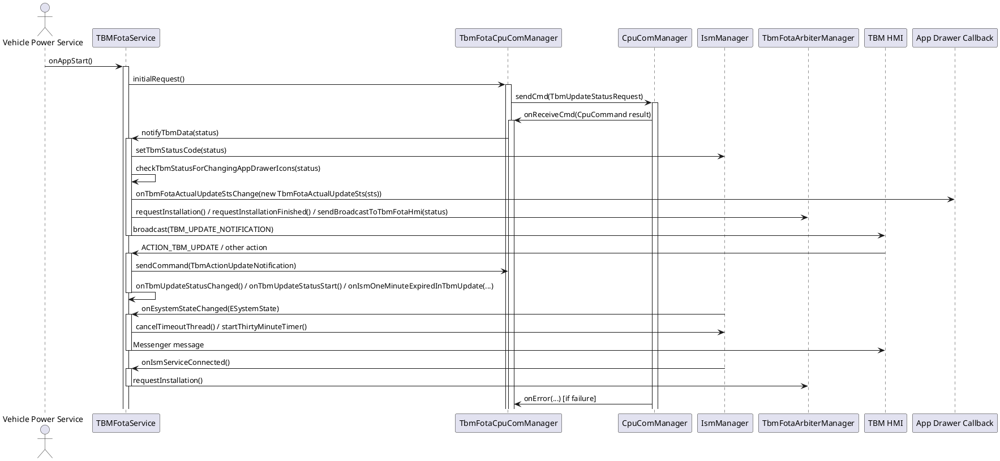

# TBMFotaService Full Detailed Analysis

This document provides a fully detailed analysis for the `TBMFotaService` module:
- exact method signatures with return types
- file-level caller/callee relationships
- separate PlantUML for app and interface modules
- runtime update flow sequence diagram

---

## App Module Detailed Analysis

### File: `app/src/main/java/com/mitsubishielectric/ahu/appservice/tbmfotaservice/TBMFotaService.java`

#### Class: `TBMFotaService`
Implements:
- `ITbmFotaCpuComServiceListener`
- `ITbmFotaCpuComManager`
- `IIsmServiceListener`
- `ITbmUpdateStatusChangeListener`

#### Public methods and signatures

- `public IBinder onBind(Intent intent)`
  - Returns: `IBinder`
  - Caller: Android framework when service is bound
  - Callee: `bindExtendedService(intent)`

- `public int onStartCommand(Intent intent, int flags, int startId)`
  - Returns: `int`
  - Caller: Android framework when service is started
  - Callee: `bindExtendedService(intent)`

- `public void onCreate()`
  - Returns: `void`
  - Caller: Android framework at service creation
  - Calls: `VehicleCfgManager.getInstance()`

- `public void notifyTbmData(int tbmUpdateStausCode)`
  - Returns: `void`
  - Caller: `TbmFotaCpuComManager.onReceiveCmd(...)`
  - Calls:
    - `mIsmManager.setTbmStatusCode(tbmUpdateStausCode)`
    - `checkTbmStatusForChangingAppDrawerIcons(tbmUpdateStausCode)`
    - `sendUpdateStatusToArbiter(tbmUpdateStausCode)`

- `public void sendBroadcastToTbmFotaHmi(int tbmUpdateStausCode)`
  - Returns: `void`
  - Caller: `sendUpdateStatusToArbiter(...)`, `onIsmDismissPopup()`
  - Calls:
    - `getUserOnOffStateInTbmFotaService(intent)`
    - `sendBroadcast(intent)`
    - optionally `onTbmUpdateStatusChanged()` or `mIsmManager.setTbmFotaDisplayStatus(...)`

- `public boolean isBoundToTbmHmi()`
  - Returns: `boolean`
  - Caller: internal logic and HMI messenger send methods

- `public void onIsmSystemStateTimed(int tbmUpdateStatus)`
  - Returns: `void`
  - Caller: `IsmManager` when ISM enters `TIMED` state
  - Calls:
    - `statusSilentReceivedInTimedState()` or `sendBroadcastToTbmFotaHmi(...)`

- `public void onIsmServiceConnected()`
  - Returns: `void`
  - Caller: `IsmManager` after successful ISM binding
  - Calls: `mTbmFotaArbiterManager.requestInstallation()` when status is avail/forced/silent

- `public void onIsmDismissPopup()`
  - Returns: `void`
  - Caller: `IsmManager` when popup dismiss is required
  - Calls: `sendBroadcastToTbmFotaHmi(mTbmUpdateStatus)`

- `public void onTbmUpdateStatusChanged()`
  - Returns: `void`
  - Caller: `TbmFotaUpdateActionReceiver.onReceive(...)`
  - Calls: `mTbmFotaArbiterManager.requestInstallationFinished()`

- `public void onTbmUpdateStatusStart()`
  - Returns: `void`
  - Caller: `TbmFotaUpdateActionReceiver.onReceive(...)`
  - Calls: `setBackLight(false)` when user is off

- `public void onIsmOneMinuteExpiredInTbmUpdate(ETbmFotaUpdateStatus mETbmFotaUpdateStatus)`
  - Returns: `void`
  - Caller: `TbmFotaUpdateActionReceiver` on timeout
  - Calls: `mIsmManager.onIsmOneMinuteExpired(...)`

- `public void onTimeOutTimerExpired()`
  - Returns: `void`
  - Caller: `IsmManager` timeout thread
  - Calls: `mTbmFotaArbiterManager.requestInstallationFinished()`

- `public void onEsystemStateChanged(ESystemState eSystemState)`
  - Returns: `void`
  - Caller: `IsmManager.ISystemStateListener.onSystemStateChange(...)`
  - Calls:
    - `mIsmManager.cancelTimeoutThread()` or `mIsmManager.startThirtyMinuteTimer()`
    - `getValueOfESystemState(...)`
    - `mService.send(Message)` if bound to HMI

- `public void onPowerButtonPressed()`
  - Returns: `void`
  - Caller: `IsmManager.ISystemStateTransitionTbmFotaUpdateListener.notifyPowerButtonPressedTbmFotaUpdate()`
  - Calls: `mService.send(Message)` to HMI

- `public void onUserOnOffStatusChanged(boolean isUserOnOff)`
  - Returns: `void`
  - Caller: `IsmManager.IAvailabilityChangeListener.onAvailabilityChange(...)`
  - Calls: `mService.send(Message)` to HMI

- `public void sendCommand(CpuCommand cmd)`
  - Returns: `void`
  - Caller: `TBMFotaService` internal or external binder consumers
  - Calls: `mFotaCpuComManager.sendCommand(cmd)`

- `public void setCpuComBinder(IBinder service)`
  - Returns: `void`
  - Caller: interface contract; not implemented in this service class

- `public void onDestroy()`
  - Returns: `void`
  - Caller: Android framework at service teardown
  - Calls: `unbindService(...)` for registered connections

#### Private methods and signatures

- `private void init()`
  - Caller: `registerToExtendedServiceManager(...)`
  - Calls:
    - `new VehiclePowerManager()`
    - `TbmFotaCpuComManager.getInstance(this)`
    - `TbmFotaArbiterManager.getInstance(this)`
    - `IsmManager.getInstance(this)`
    - `bindService(...)` to TBM HMI
    - `registerReceiver(...)` for ESM and HMI actions

- `private void bindToIsm()`
  - Caller: `registerToExtendedServiceManager(...)`
  - Calls: `mIsmManager.bindService(getApplicationContext())`

- `private void subscribeToVps()`
  - Caller: `registerToExtendedServiceManager(...)`
  - Calls:
    - `ExtSrvManager.getService(Const.CPU_COM_SERVICE)`
    - `mFotaCpuComManager.setCpuComBinder(...)`
    - `mVehiclePowerManager.init()`
    - `mVehiclePowerManager.subscribe(mVehiclePowerServiceListener)`

- `private void bindExtendedService(Intent intent)`
  - Caller: `onBind(...)`, `onStartCommand(...)`
  - Calls: `initiateExtSrv(...)` or `bindEsmService()`

- `private void initiateExtSrv(IBinder service)`
  - Caller: `bindExtendedService(...)`
  - Calls: `registerToExtendedServiceManager(service)`

- `private void bindEsmService()`
  - Caller: `bindExtendedService(...)`
  - Calls: `bindService(...)` to ESM package

- `private void registerToExtendedServiceManager(IBinder esmBinder)`
  - Caller: `initiateExtSrv(...)`, `bindEsmService()` via callback
  - Calls:
    - `ExtSrvManager.setBinder(esmBinder)`
    - `ExtSrvManager.getInstance()`
    - `mExtSrvManager.getService(Const.VEHICLE_CONFIG_READER_SERVICE)`
    - `initiateVehicleConfigReaderService(...)`
    - `checkVehicleLineConfigIsApplicableForTbm()`
    - `init()`, `bindToIsm()`, `subscribeToVps()` on applicable vehicles

- `private void initiateVehicleConfigReaderService(IBinder vehicleConfigReaderBinder)`
  - Caller: `registerToExtendedServiceManager(...)`
  - Calls: `mVehicleCfgManager.setVehicleConfigReaderBinder(vehicleConfigReaderBinder)`

- `private int getECallButtonValue()`
  - Returns: `int`
  - Caller: `sendBroadcastToTbmFotaHmi(...)`
  - Calls: `VehicleCfgManager.getInstance().getByte(...)`

- `private boolean getUserOnOffStateInTbmFotaService(Intent mIntent)`
  - Returns: `boolean`
  - Caller: `sendBroadcastToTbmFotaHmi(...)`
  - Calls: `mIsmManager.getUserOnOffState()`

- `private void setBackLight(boolean isBackLightOn)`
  - Caller: `getUserOnOffStateInTbmFotaService(...)`, `onTbmUpdateStatusChanged()`, `onTbmUpdateStatusStart()`
  - Calls: `mIsmManager.setTbmFotaDisplayStatus(...)`

- `private boolean checkVehicleLineConfigIsApplicableForTbm()`
  - Returns: `boolean`
  - Caller: `registerToExtendedServiceManager(...)`
  - Calls:
    - `VehicleCfgManager.getInstance().getByte(...)`
    - `VehicleCfgManager.getInstance().getString(...)`

- `private void sendUpdateStatusToArbiter(int tbmUpdateStausCode)`
  - Caller: `notifyTbmData(...)`
  - Calls:
    - `mTbmFotaArbiterManager.requestInstallation()` or `requestInstallationFinished()`
    - `sendBroadcastToTbmFotaHmi(...)`

- `private void statusSilentReceivedInTimedState()`
  - Caller: `onIsmSystemStateTimed(...)`
  - Calls: `mTbmFotaArbiterManager.requestInstallationFinished()` or `sendBroadcastToTbmFotaHmi(...)`

- `private int getValueOfESystemState(ESystemState eSystemState)`
  - Returns: `int`
  - Caller: `onEsystemStateChanged(...)`

- `private void checkTbmStatusForChangingAppDrawerIcons(int tbmUpdateStausCode)`
  - Caller: `notifyTbmData(...)`
  - Calls: `notifyTbmUpdateStsToAppDrawer(true|false)`

- `private void notifyTbmUpdateStsToAppDrawer(boolean sts)`
  - Caller: `checkTbmStatusForChangingAppDrawerIcons(...)`
  - Calls: `mTbmFotaActualUpdateStsCallback.onTbmFotaActualUpdateStsChange(new TbmFotaActualUpdateSts(sts))`

#### Internal callback relationships
- `mTbmFotaHmiServiceConnection.onServiceConnected(...)` sets HMI binding and messenger object
- `mSyncConnection.onServiceConnected(...)` registers ESM service manager
- `mVehiclePowerServiceListener` methods call into TBMFotaService lifecycle and CPU request logic
- `mExtSrvMgnBroadcastReceiver.onReceive(...)` handles external service reboot binder updates
- `mFwRebootBroadcastReceiver.onReceive(...)` handles framework service reboot and sets vehicle config reader binder

---

### File: `app/src/main/java/com/mitsubishielectric/ahu/appservice/tbmfotaservice/TbmFotaUpdateActionReceiver.java`

#### Class: `TbmFotaUpdateActionReceiver`

##### Methods
- `public TbmFotaUpdateActionReceiver(ITbmFotaCpuComManager mTbmFotaCpuComManager)`
  - Returns: constructor
  - Caller: `TBMFotaService.init()`

- `public void onReceive(Context context, Intent intent)`
  - Returns: `void`
  - Caller: Android broadcast system
  - Calls depending on action:
    - `mITbmUpdateStatusChangeListener.onTbmUpdateStatusChanged()`
    - `mTbmFotaCpuComManager.sendCommand(new TbmActionUpdateNotification(updateAction))`
    - `mITbmUpdateStatusChangeListener.onTbmUpdateStatusStart()`
    - `mITbmUpdateStatusChangeListener.onIsmOneMinuteExpiredInTbmUpdate(ETbmFotaUpdateStatus.AVAILABLE_USER_OFF)`

##### Caller/Callee mapping
- Called by: Android broadcast receiver when HMI sends TBM update actions
- Calls into: `TBMFotaService` via `ITbmUpdateStatusChangeListener`
- Calls into: `TbmFotaCpuComManager.sendCommand(...)`

---

### File: `app/src/main/java/com/mitsubishielectric/ahu/appservice/tbmfotaservice/cpucom/TbmFotaCpuComManager.java`

#### Class: `TbmFotaCpuComManager`
Implements: `ITbmFotaCpuComManager`

##### Methods
- `public static TbmFotaCpuComManager getInstance(ITbmFotaCpuComServiceListener itbmFotaCpuComServiceListener)`
  - Returns: `TbmFotaCpuComManager`
  - Caller: `TBMFotaService.init()`, `IsmManager` constructor

- `public void setCpuComBinder(IBinder service)`
  - Returns: `void`
  - Caller: `TBMFotaService.subscribeToVps()`
  - Calls: `CpuComManager.setBinder(service)`, `subscribe(new TbmUpdateStatusNotification(), mCpuComServiceListener)`, `subscribeError(mCpuComServiceErrorListener)`

- `public void initialRequest()`
  - Returns: `void`
  - Caller: `VehiclePowerManager.onAppStart()`, `VehiclePowerManager.onAppRestart()`, `VehiclePowerManager.onAppResume()`, `IsmManager.ISystemStateListener.onSystemStateChange(...)`
  - Calls: `sendCommand(new TbmUpdateStatusRequest())`

- `public void sendCommand(CpuCommand cmd)`
  - Returns: `void`
  - Caller: `TBMFotaService.sendCommand(...)`, `TbmFotaUpdateActionReceiver.onReceive(...)`
  - Calls: `CpuComManager.getInstance().sendCmd(cmd)`

- `public static String byteArrayToHex(byte[] raw)`
  - Returns: `String`
  - Caller: logging only

- `private void subscribe(CpuCommand cmd, ICpuComServiceListener callback)`
  - Returns: `void`
  - Caller: `setCpuComBinder(...)`
  - Calls: `CpuComManager.getInstance().subscribeCB(cmd, callback)`

- `private void subscribeError(ICpuComServiceErrorListener callback)`
  - Returns: `void`
  - Caller: `setCpuComBinder(...)`

- `private void unsubscribe(CpuCommand cmd, ICpuComServiceListener callback)`
  - Returns: `void`
  - Not directly called in the current app code

##### Internal callback behavior
- `ICpuComServiceListener.onReceiveCmd(CpuCommand cpuCommand)`
  - Caller: `CpuComManager` when CPU sends response
  - Calls: `mTbmFotaCpuComServiceListener.notifyTbmData(data[0])`

- `ICpuComServiceErrorListener.onError(int i, CpuCommand cpuCommand)`
  - Caller: `CpuComManager` on error
  - Behavior: logs and no further action

---

### File: `app/src/main/java/com/mitsubishielectric/ahu/appservice/tbmfotaservice/arbiter/TbmFotaArbiterManager.java`

#### Class: `TbmFotaArbiterManager`

##### Methods
- `public static TbmFotaArbiterManager getInstance(Context mContext)`
  - Returns: `TbmFotaArbiterManager`
  - Caller: `TBMFotaService.init()`

- `public void requestInstallation()`
  - Returns: `void`
  - Caller: `TBMFotaService.sendUpdateStatusToArbiter(...)`, `TBMFotaService.onIsmServiceConnected()`
  - Calls: `mArbiterServiceManager.installationRequest(UPDATE_TYPE.OTA_TBM, mIInstallationRequestApprovalListener)`

- `public void requestInstallationFinished()`
  - Returns: `void`
  - Caller: `TBMFotaService.sendUpdateStatusToArbiter(...)`, `TBMFotaService.onTbmUpdateStatusChanged()`, `TBMFotaService.statusSilentReceivedInTimedState()`, `TBMFotaService.onTimeOutTimerExpired()`
  - Calls: `mArbiterServiceManager.installationFinished(UPDATE_TYPE.OTA_TBM)`

- `public boolean getRequestInstallationStatus()`
  - Returns: `boolean`
  - Caller: `TBMFotaService.onIsmSystemStateTimed(...)`

- `public ERequestApproverState getERequestApproverState()`
  - Returns: `ERequestApproverState`
  - Caller: `TBMFotaService.onIsmSystemStateTimed(...)`

##### Internal callback behavior
- `onRequestGranted()` updates internal state
- `onRequestDenied()` updates internal state

---

### File: `app/src/main/java/com/mitsubishielectric/ahu/appservice/tbmfotaservice/ism/IsmManager.java`

#### Class: `IsmManager`

##### Methods
- `public static IsmManager getInstance(IIsmServiceListener mIIsmServiceListener)`
  - Returns: `IsmManager`
  - Caller: `TBMFotaService.init()`

- `public void bindService(Context context)`
  - Returns: `void`
  - Caller: `TBMFotaService.bindToIsm()`
  - Calls: `context.bindService(...)` to ISM package

- `public void setTbmStatusCode(int tbmStatusCode)`
  - Returns: `void`
  - Caller: `TBMFotaService.notifyTbmData(...)`

- `public boolean getUserOnOffState()`
  - Returns: `boolean`
  - Caller: `TBMFotaService.getUserOnOffStateInTbmFotaService(...)`, `TBMFotaService.onTbmUpdateStatusChanged()`, `TBMFotaService.onTbmUpdateStatusStart()`, `TBMFotaService.statusSilentReceivedInTimedState()`

- `public void setTbmFotaDisplayStatus(ETbmFotaPopupStatus mETbmFotaPopupStatus)`
  - Returns: `void`
  - Caller: `TBMFotaService.setBackLight(...)`, `TBMFotaService.onEsystemStateChanged(...)` indirectly
  - Calls: `mInfotainmentStateManagerService.tbmFotaPopupDisplayStatusChanged(...)`

- `public void startSubscribingToIsmSystemState()`
  - Returns: `void`
  - Caller: `TBMFotaService.onAppStart()`, `onAppRestart()`, `onAppResume()`, `IsmManager` retry logic
  - Calls: subscription retry thread to register `ISystemStateListener`

- `public void startThirtyMinuteTimer()`
  - Returns: `void`
  - Caller: `TBMFotaService.onEsystemStateChanged(...)`
  - Calls: handler postDelayed for `TimedStateTimeOutThread`

- `public void cancelTimeoutThread()`
  - Returns: `void`
  - Caller: `TBMFotaService.onEsystemStateChanged(...)`

- `public void onIsmOneMinuteExpired(ETbmFotaUpdateStatus eTbmFotaUpdateStatus)`
  - Returns: `void`
  - Caller: `TBMFotaService.onIsmOneMinuteExpiredInTbmUpdate(...)`
  - Calls: `mInfotainmentStateManagerService.tbmFotaUpdateStatusChanged(...)`

##### Internal callback behavior
- `mISystemStateListener.onSystemStateChange(ESystemState)`
  - Caller: ISM framework
  - Calls: `mIIsmServiceListener.onEsystemStateChanged(...)` and possibly `onIsmSystemStateTimed(...)` or initial CPU request

- `mITbmFotaUpdateStatusListener.onTbmFotaUpdateStatusChanged(...)`
  - Caller: ISM framework
  - Updates internal state only

- `mISystemStateTransitionTbmFotaUpdateListener.notifyPowerButtonPressedTbmFotaUpdate(...)`
  - Caller: ISM framework
  - Calls: `mIIsmServiceListener.onPowerButtonPressed()`

- `mIAvailabilityChangeListener.onAvailabilityChange(...)`
  - Caller: ISM framework
  - Calls: `mIIsmServiceListener.onUserOnOffStatusChanged(...)` and possibly `onIsmDismissPopup()`

---

### File: `app/src/main/java/com/mitsubishielectric/ahu/appservice/tbmfotaservice/data/config/VehicleCfgManager.java`

#### Class: `VehicleCfgManager`
Implements: `IVehicleCfgManager`

##### Methods
- `public static VehicleCfgManager getInstance()`
  - Returns: `VehicleCfgManager`
  - Caller: `TBMFotaService.onCreate()`, `TBMFotaService.getECallButtonValue()`, `TBMFotaService.checkVehicleLineConfigIsApplicableForTbm()`

- `public void setVehicleConfigReaderBinder(IBinder readerBinder)`
  - Returns: `void`
  - Caller: `TBMFotaService.initiateVehicleConfigReaderService(...)`
  - Calls: `VehicleConfigManager.setReaderBinder(readerBinder)`

- `public void setVehicleConfigWriterBinder(IBinder writerBinder)`
  - Returns: `void`
  - Not directly called in current TBMFotaService code
  - Calls: `VehicleConfigManager.setWriterBinder(writerBinder)`

- `public int getByte(String key, VCByte value)`
  - Returns: `int`
  - Caller: `TBMFotaService.getECallButtonValue()`, `TBMFotaService.checkVehicleLineConfigIsApplicableForTbm()`
  - Calls: `VehicleConfigManager.getInstance().getByte(key, value)`

- `public int getString(String key, VCString value)`
  - Returns: `int`
  - Caller: `TBMFotaService.checkVehicleLineConfigIsApplicableForTbm()`
  - Calls: `VehicleConfigManager.getInstance().getString(key, value)`

---

### File: `app/src/main/java/com/mitsubishielectric/ahu/appservice/tbmfotaservice/VehiclePowerManager.java`

#### Class: `VehiclePowerManager`

##### Methods
- `public VehiclePowerManager()`
  - Returns: constructor
  - Caller: `TBMFotaService.init()`

- `public void init()`
  - Returns: `void`
  - Caller: `TBMFotaService.subscribeToVps()`
  - Calls: `ExtSrvManager.getInstance()`, `VehiclePowerServiceManager.setBinder(...)`

- `public void subscribe(IVehiclePowerServiceListener vehiclePowerServiceListener)`
  - Returns: `void`
  - Caller: `TBMFotaService.subscribeToVps()`
  - Calls: `VehiclePowerServiceManager.getInstance().subscribeApp(...)`

- `public void stopProcessingComplete()`
  - Returns: `void`
  - Caller: `TBMFotaService.mVehiclePowerServiceListener.onAppStop()`
  - Calls: `VehiclePowerServiceManager.getInstance().stopCompleteApp(...)`

- `public void notifyStartComplete()`
  - Returns: `void`
  - Caller: `TBMFotaService.mVehiclePowerServiceListener.onAppStart()`
  - Calls: `VehiclePowerServiceManager.getInstance().startComplete(...)`

- `public void notifyResumeComplete()`
  - Returns: `void`
  - Caller: `TBMFotaService.mVehiclePowerServiceListener.onAppResume()`
  - Calls: `VehiclePowerServiceManager.getInstance().resumeCompleteApp(...)`

- `public void notifyRestartComplete()`
  - Returns: `void`
  - Caller: `TBMFotaService.mVehiclePowerServiceListener.onAppRestart()`
  - Calls: `VehiclePowerServiceManager.getInstance().restartCompleteApp(...)`

---

### Command classes and interfaces

#### `app/src/main/java/com/mitsubishielectric/ahu/appservice/tbmfotaservice/command/TbmUpdateStatusRequest.java`
- `public TbmUpdateStatusRequest()`
- Caller: `TbmFotaCpuComManager.initialRequest()`

#### `app/src/main/java/com/mitsubishielectric/ahu/appservice/tbmfotaservice/command/TbmUpdateStatusNotification.java`
- `public TbmUpdateStatusNotification()`
- Caller: `TbmFotaCpuComManager.setCpuComBinder(...)`

#### `app/src/main/java/com/mitsubishielectric/ahu/appservice/tbmfotaservice/command/TbmActionUpdateNotification.java`
- `public TbmActionUpdateNotification(int updateAction)`
- Caller: `TbmFotaUpdateActionReceiver.onReceive(...)`

#### Interface: `ITbmFotaCpuComManager`
- `void sendCommand(CpuCommand cmd)`
- `void setCpuComBinder(IBinder service)`

#### Interface: `ITbmFotaCpuComServiceListener`
- `void notifyTbmData(int updateStatusOfTbm)`

#### Interface: `IIsmServiceListener`
- `void onIsmSystemStateTimed(int tbmUpdateStatus)`
- `void onIsmServiceConnected()`
- `void onIsmDismissPopup()`
- `void onTimeOutTimerExpired()`
- `void onEsystemStateChanged(ESystemState eSystemState)`
- `void onPowerButtonPressed()`
- `void onUserOnOffStatusChanged(boolean isUserOnOff)`

#### Interface: `ITbmUpdateStatusChangeListener`
- `void onTbmUpdateStatusChanged()`
- `void onTbmUpdateStatusStart()`
- `void onIsmOneMinuteExpiredInTbmUpdate(ETbmFotaUpdateStatus mETbmFotaUpdateStatus)`

#### Interface: `IVehicleCfgManager`
- `void setVehicleConfigReaderBinder(IBinder readerBinder)`
- `void setVehicleConfigWriterBinder(IBinder writerBinder)`
- `int getByte(String key, VCByte value)`
- `int getString(String key, VCString value)`

---

## Interface Module Detailed Analysis

### File: `tbmfotaserviceinterface/src/main/java/com/mitsubishielectric/ahu/lib/tbmfotaserviceinterface/TbmFotaActualUpdateSts.java`

#### Class: `TbmFotaActualUpdateSts`

##### Methods
- `public TbmFotaActualUpdateSts(boolean available)`
  - Returns: constructor
  - Caller: `TBMFotaService.notifyTbmUpdateStsToAppDrawer(...)`

- `public boolean isAvailable()`
  - Returns: `boolean`
  - Caller: `ITbmFotaActualUpdateStsCallback.onTbmFotaActualUpdateStsChange(...)` consumers

- `public int describeContents()`
  - Returns: `int`
  - Caller: Parcelable framework

- `public void writeToParcel(Parcel parcel, int i)`
  - Returns: `void`
  - Caller: Parcelable framework

- `private TbmFotaActualUpdateSts(Parcel in)`
  - Returns: constructor
  - Caller: `Creator.createFromParcel(...)`

- `public static final Creator<TbmFotaActualUpdateSts> CREATOR`
  - Methods:
    - `createFromParcel(Parcel in)`
    - `newArray(int size)`

### File: `tbmfotaserviceinterface/src/main/aidl/com/mitsubishielectric/ahu/lib/tbmfotaserviceinterface/ITbmFotaActualUpdateStsManager.aidl`

#### Interface: `ITbmFotaActualUpdateStsManager`
- `void registerAsyncConnection(ITbmFotaActualUpdateStsCallback tbmFotaCallback)`
  - Caller: external client binding to `TBMFotaService`
  - Callee: `TBMFotaService.mTbmFotaServiceBinder.registerAsyncConnection(...)`

- `void unRegisterAsyncConnection(ITbmFotaActualUpdateStsCallback tbmFotaCallback)`
  - Caller: external client
  - Callee: `TBMFotaService.mTbmFotaServiceBinder.unRegisterAsyncConnection(...)`

### File: `tbmfotaserviceinterface/src/main/aidl/com/mitsubishielectric/ahu/lib/tbmfotaserviceinterface/ITbmFotaActualUpdateStsCallback.aidl`

#### Interface: `ITbmFotaActualUpdateStsCallback`
- `void onTbmFotaActualUpdateStsChange(in TbmFotaActualUpdateSts state)`
  - Caller: `TBMFotaService.notifyTbmUpdateStsToAppDrawer(...)`
  - Callee: external client registered to the binder

---

## Sequence Diagram: Runtime Update Flow

### Overview
This sequence diagram shows the runtime flow from initial update request through CPU response handling, ISM state integration, arbiter coordination, and HMI/app drawer notification.

---

## PlantUML Code for App and Interface Modules

### App module PlantUML

Use the existing file `TBMFotaService_App_PlantUML.md`.

### Interface module PlantUML

Use the existing file `TBMFotaService_Interface_PlantUML.md`.

---

## Notes
- This document is fully detailed at the module and file level for the `TBMFotaService` app and interface code.
- It includes exact method return types, who calls each method, and the major call relationships.
- The runtime sequence diagram is focused on TBM update status handling, from CPU request through UI/HMI notification.
